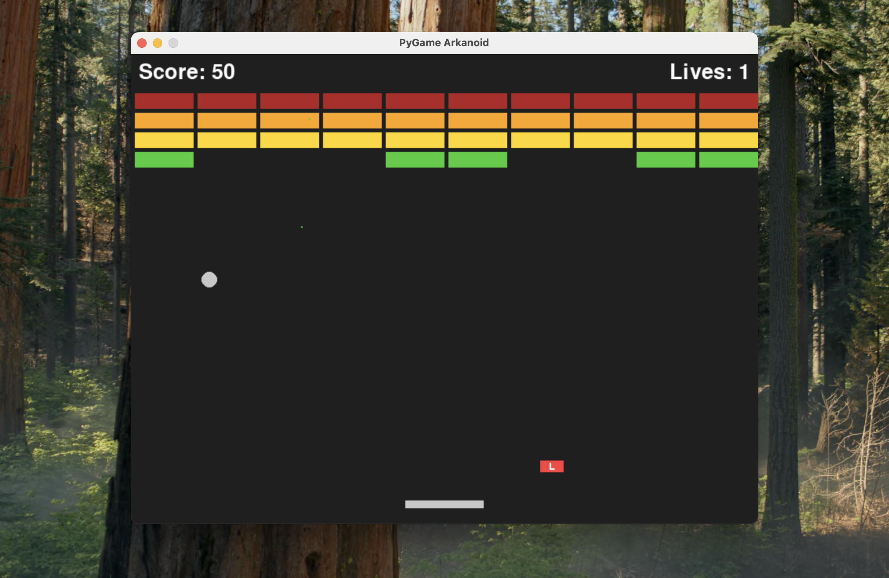

# PyGame Arkanoid



A modern, highly-polished Arkanoid clone built with Python and PyGame. This version features advanced collision physics, dynamic paddle control, a brick Hit Points (HP) system, and centralized configuration for easy modding.

## Key Features

- **Advanced Physics Engine**: The ball features perfect corner and edge collision detection without glitching into bricks.
- **Dynamic Paddle Control**: Hit the ball on the edge of the paddle to give it an extreme horizontal speed (`MAX_BALL_SPEED_X`), allowing skilled players to aim at specific bricks.
- **Brick HP System**: Bricks can take multiple hits depending on their level. Indestructible boundary bricks are also supported.
- **Centralized Configurations**: All visual settings, physics constants, colors, and speeds are cleanly separated into `settings.py`.
- **Power-Ups**: Includes Shrink (S), Grow (G), Fast Ball (F), Slow Ball (D), Extra Life (1), and Laser Paddle (L).
- **Particle Effects**: Spectacular particle bursts when bricks are destroyed, with customizable lifetimes and speeds.
- **Levels**: Dynamic generation of multiple levels with varying patterns.

## Installation & Setup

1. **Prerequisites**: Ensure you have `Python 3` and `pip` installed.
2. **Clone the Repository**:
   ```bash
   git clone <repository_url>
   cd pygame-arkanoid
   ```
3. **Set up Virtual Environment** (Optional but Recommended):
   ```bash
   python3 -m venv env
   source env/bin/activate  # On Windows use `env\Scripts\activate`
   ```
4. **Install Dependencies**:
   ```bash
   pip3 install -r requirements.txt
   ```
5. **Run the Game**:
   ```bash
   python3 main.py
   ```

## Controls
- `Left / Right Arrows`: Move the paddle
- `Space`: Start the game / Launch the ball
- `F`: Shoot lasers (when Laser power-up is active)
- `Mouse Click`: Toggle Sound on/off (Button on the bottom right)
- `Close Window`: Exit Game

## Customizing the Game
You can easily tweak the game's difficulty and aesthetics by editing `settings.py`. Some fun things to try:
- Increase `PARTICLE_COUNT` for massive explosions.
- Change `BALL_SPEED` or `PADDLE_SPEED`.
- Adjust `FIELD_LEFT` to change the padding around the playing field.

## What's Next?
- High Score saving system
- More complex level designs loaded from files
- Additional power-ups (e.g., Multi-ball)
